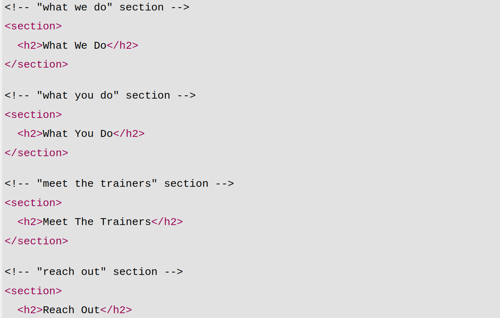

# ✨ (1-1)

- ဒီသင်ခန်းစာမှာ HTML code ရဲ့ ပထမတစ်ဆင့်ဖြစ်တဲ့ အရေးကြီးတဲ့ Tools နဲ့ Processes တွေအကြောင်းသင်ကြားပေးမှာဖြစ်ပါတယ်

## 💡 ရေးသားရမည့် ပုံစံ
- example.png)

## ရေးပုံရေးသားနည်း

### comment ရေးနည်း
- ရေးသားထားတဲ့codeများကို လွယ်လွယ်ကူကူ ဖတ်နိုင်ပြီး နားလည်စေဖို့ ပထမဆုံး comment ကိုထည့်ရေးပေးရမည်။ 

- (ctrl + /) ကိုအသုံးပြု၍ ရေးသားရမည်။

- 

### HTML code ရေးနည်း
-  ဒီသင်ခန်းစာရဲ့ body tag ထဲမှာဆိုရင်တော့ HTML တစ်ခုတည်းဖြင့်သာ သီးသန့်အသုံးပြု သင်ကြားပေးထားပါသည်။

- (1-1) ရဲ့ body မှာဆိုရင်တော့ အပိုင်းတစ်ခုခြင်းစီအတွက် section tagsကိုအသုံးပြုထားပါတယ်။

- section tags 5ခုဖြင့် ရေးထားပြီး (1st section - "Hero/Jumbotron" section, 2nd section - "what we do" section, 3rd section - "what you do" section, 4th section - "meet the trainers" section, 5th section - "Reach Out" section) တို့ဖြစ်ပါတယ်။

- section တစ်ခုချင်းစီရဲ့ title အတွက် "h2" tag ကိုအသုံးပြုပေးရမယ်။ Header ပိုင်းတွင် "h1" tag ကိုအသုံးပြူထားခြင်းကြောင့် body ပိုင်းဧ။် section တစ်ခုချင်းစီတွင် "h2" tagကိုအသုံးပြုပေးရခြင်းဖြစ်ပါသည်။

        <!-- hero/ jumbotron -->
        <section>
        </section>

        <!-- "what we do" section -->
        <section>
          <h2>What We Do</h2>
        </section>

        <!-- "what you do" section -->
        <section>
          <h2>What You Do</h2>
        </section>

        <!-- "meet the trainers" section -->
        <section>
          <h2>Meet The Trainers</h2>
        </section>

        <!-- "reach out" section -->
        <section>
          <h2>Reach Out</h2>
        </section>

# ✨ (1-2)

- lesson(1-1)မှာဆိုရင် HTML သီးသန့်သာ သုံးထားပြီး lesson(1-2)မှာဆိုရင်တော့ CSSကို စတင်အသုံးပြုလာပြီး HTML နဲ့ CSS ကိုဘယ်လိုချိတ်ဆက် အသုံးပြုရမလဲဆိုတာ သင်ကြားပေးထားပါတယ်။

## 💡 ရေးသားရမည့် ပုံစံ 
- example.png)

## ရေးပုံရေးသားနည်း

### HTML နှင့် CSS ချိတ်ဆက်နည်း

- "html tag" ရဲ့ head ထဲမှာ "link tag" ကိုခေါ်သုံးရမည်။
        
        <link rel="stylesheet" href="">

- link tagထဲရှိ href (Hyper Reference)ထဲတွင် file ဧ။်တည်နေရာကိုရွေးပြီး ချိတ်ဆက်ပေးရမည်။

        <link rel="stylesheet" href="./assets/css/style.css" />

### CSS code ရေးနည်း

- ဒီသင်ခန်းစာမှာ css properties ကိုသုံးပြီးတော့ color ဘယ်လို change လဲဆိုတာ ပြောပြပေးထားပါတယ်။

- Bodyပိုင်းမှာဆိုရင်တော့ CSSကိုသုံးပြီး text colorကိုပြောင်းထားပါတယ်။

        body {
          color: #39a6b2;
          font-family: Helvetica, Arial, sans-serif;
        }

# ✨(1-3)

- (1-3)ရဲ့ bodyပိုင်းမှာဆိုရင်တော့ (Hero/Jumbotron) Bckground Image ထည့်ပြီး (Registration Form) နာမည်စာရင်းပေးနည်းပုံစံ ရေးသားနည်းကို သင်ကြားပေးထားပါသည်။

## 💡 ရေးသားရမည့် ပုံစံ 
- example.png)

## ရေးပုံရေးသားနည်း

### HTML code ရေးနည်း

- section tag ထဲမှာ class name "hero"

### CSS code ရေးနည်း