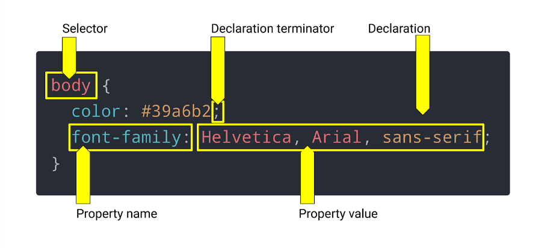

# ✨ (1-1)

- ဒီသင်ခန်းစာမှာ HTML code ရဲ့ ပထမတစ်ဆင့်ဖြစ်တဲ့ အရေးကြီးတဲ့ Tools နဲ့ Processes တွေအကြောင်းသင်ကြားပေးမှာဖြစ်ပါတယ်

## 💡 ရေးသားရမည့် ပုံစံ
 example.png)

## ရေးပုံရေးသားနည်း

### comment ရေးနည်း
- ရေးသားထားတဲ့codeများကို လွယ်လွယ်ကူကူ ဖတ်နိုင်ပြီး နားလည်စေဖို့ ပထမဆုံး comment ကိုထည့်ရေးပေးရမည်။ 

- (ctrl + /) ကိုအသုံးပြု၍ ရေးသားရမည်။

-

### HTML code ရေးနည်း
-  ဒီသင်ခန်းစာရဲ့ body tag ထဲမှာဆိုရင်တော့ HTML တစ်ခုတည်းဖြင့်သာ သီးသန့်အသုံးပြု သင်ကြားပေးထားပါသည်။

- (1-1) ရဲ့ body မှာဆိုရင်တော့ အပိုင်းတစ်ခုခြင်းစီအတွက် section tagsကိုအသုံးပြုထားပါတယ်။

- Section tags 5ခုဖြင့် ရေးထားပြီး (1st section - "Hero/Jumbotron" section, 2nd section - "what we do" section, 3rd section - "what you do" section, 4th section - "meet the trainers" section, 5th section - "Reach Out" section) တို့ဖြစ်ပါတယ်။

- Section တစ်ခုချင်းစီရဲ့ title အတွက် "h2" tag ကိုအသုံးပြုပေးရမယ်။ Header ပိုင်းတွင် "h1" tag ကိုအသုံးပြူထားခြင်းကြောင့် body ပိုင်းဧ။် section တစ်ခုချင်းစီတွင် "h2" tagကိုအသုံးပြုပေးရခြင်းဖြစ်ပါသည်။

        <!-- hero/ jumbotron -->
        <section>
        </section>

        <!-- "what we do" section -->
        <section>
          <h2>What We Do</h2>
        </section>

        <!-- "what you do" section -->
        <section>
          <h2>What You Do</h2>
        </section>

        <!-- "meet the trainers" section -->
        <section>
          <h2>Meet The Trainers</h2>
        </section>

        <!-- "reach out" section -->
        <section>
          <h2>Reach Out</h2>
        </section>

# ✨ (1-2)

- Lesson(1-1)မှာဆိုရင် HTML သီးသန့်သာ သုံးထားပြီး lesson(1-2)မှာဆိုရင်တော့ CSSကို စတင်အသုံးပြုလာပြီး HTML နဲ့ CSS ကိုဘယ်လိုချိတ်ဆက် အသုံးပြုရမလဲဆိုတာ သင်ကြားပေးထားပါတယ်။

## 💡 CSS Syntax (css ရေးသားနည်း)

- CSS ရေးသားနည်း အမျိုးမျိုးရှိပြီး အသုံးပြုသူ(user)တွေက (property)လို့ခေါ်တဲ့ ကြိုတင်သတ်မှတ်ပြီးသား designပြုပြင်နိုင်သော (style characteristic)ကို HTML element (HTML tags) များနှင့်တွဲပြီး အသုံးပြုနိုင်ပါတယ်။

- အောက်ပါပုံတွင်ပြထားသည့်အတိုင်း CSS syntax အချို့ကို ကြည့်နိုင်ပါတယ်

### ရှင်းပြချက်

#### Selector
- Selector ဆိုတာ HTML element လို့ခေါ်တဲ့ (body tag)ကို ခေါ်သုံးထားခြင်းဖြစ်ပြီး element selectorလို့ခေါ်ခြင်းဖြစ်ပါတယ်။
 
- (class)ကိုခေါ်သုံးရင် class selector လို့ခေါ်ပြီး (id)ကိုခေါ်သုံးရင် id selector လို့ခေါ်ပါတယ်။

#### Property name
- Selectorကိုခေါ်ပြီးနောက် {} (curly brackets)ကိုခေါ်ပြီး {} (curly brackets) ထဲတွင် အသုံးပြုချင်သော property name ကိုခေါ်ပြီး အသုံးပြုနိုင်ပါတယ်။

- CSS properties name ရဲ့ examples တွေကတော့ color(စာသားအရောင်), background-image (နောက်ခံပုံထည့်ခြင်း), font-family (စာသားပုံစံပြောင်းခြင်း) အစရှိသဖြင့် အမျိုးမျိုးရှိကြပါတယ်။

#### Property value

- Property value ဆိုတာ property name ကိုအထူးပြုထားခြင်းကိုဆိုလိုပါတယ်။

- CSS properties value ရဲ့ examples တွေကတော့ (color:red;)ထဲမှာဆိုရင်တော့ red ကိုကိုယ်စားပြုခြင်းဖြစ်ပါတယ်။

#### Declaration terminator

- Declaration terminator ဆိုတာ property တစ်ခုနဲ့တစ်ခုကို အဆုံးတွင် ချိတ်ဆက်ပေးသော semicolon (;)ကို ခေါ်ခြင်းဖြစ်ပါတယ်။

- semicolon (;) မပါရင် propertiesတွေက အလုပ်မလုပ်သောကြောင့် semicolon (;)ကိုမဖြစ်မနေ ရေးပေးရပါမည်။

## 💡 ရေးသားရမည့် ပုံစံ 
 example.png)

## ရေးပုံရေးသားနည်း

### HTML နှင့် CSS ချိတ်ဆက်နည်း

- "html tag" ရဲ့ head ထဲမှာ "link tag" ကိုခေါ်သုံးရမည်။
        
        <link rel="stylesheet" href="">

- link tagထဲရှိ href (Hyper Reference)ထဲတွင် file ဧ။်တည်နေရာကိုရွေးပြီး ချိတ်ဆက်ပေးရမည်။

        <link rel="stylesheet" href="./assets/css/style.css" />

### CSS code ရေးနည်း

- ဒီသင်ခန်းစာမှာ css properties ကိုသုံးပြီးတော့ color ဘယ်လို change လဲဆိုတာ ပြောပြပေးထားပါတယ်။

- Bodyပိုင်းမှာဆိုရင်တော့ CSSကိုသုံးပြီး text colorကိုပြောင်းထားပါတယ်။

        body {
          color: #39a6b2;
          font-family: Helvetica, Arial, sans-serif;
        }

# ✨(1-3)

- (1-3)ရဲ့ bodyပိုင်းမှာဆိုရင်တော့ (Hero/Jumbotron) Bckground Image ထည့်ပြီး (Sign-Up Form) နာမည်စာရင်းပေးနည်းပုံစံ ရေးသားနည်းကို သင်ကြားပေးထားပါသည်။

## 💡 ရေးသားရမည့် ပုံစံ 
example.png)

## ရေးပုံရေးသားနည်း

### Hero structure (Background Image) တည်ဆောက်နည်း

- html elementတစ်ခုကို အသုံးပြုပြီး Hero Section တစ်ခု တည်​ဆောက်ရပါမယ်။

- Hero section ကိုအထူးပြုတဲ့ class attribute ကို  section tagထဲတွင် ထည့်ရေးပေးရပါမယ်။

- Hero section ထဲတွင် sign-up-form ပေါ်ချင်သောကြောင့် html element (tag) တစ်ခု တည်ဆောက်ပေးရမည်။

- sign-up-formကိုအထူးပြုတဲ့ class attribute ကို  တည်ဆောက်ထားသော element ထဲတွင် ထည့်ရေးပေးရပါမယ်။

- Hero section အတွင်း၌ image ပေါ်ချင်သောကြောင့် css positionကို  relative ထည့်ရေးပြီး sign-up formကို image ပေါ်တွင်ပေါ်ချင်သောကြောင့် css positionကို  absolute ထည့်ရေးပေးရမည်။

#### HTML code ရေးနည်း
      <!-- hero/jumbotron -->
      <section class="hero">
        

          
        

      </section>  

#### CSS code ရေးသားနည်း
        .hero {
                background-image: url('../images/hero-bg.jpg');
                height: 600px;
                background-size: cover;
                background-position: center;
                position: relative;
              }

### Sign-Up Form ထည့်နည်း

- Background image တွက်သူံးထားသော section tagထဲတွင် sign-up form ကိုရေးရမည်။
- Section tag အတွင်းရှိသော divထဲတွင် form tag

#### ထည့်ရမည့်ပုံစံ

#### Html code ရေးနည်း

        <!-- hero/jumbotron -->
        <section class="hero">
          

            <h3>Get Started Today</h3>
            
Fill out this form and one of our trainers will schedule a consult

            <form>
              <label for="name">Enter full name:</label>
              <input type="text" placeholder="Your Name" name="name" id="name" class="form-input" />
              <label for="email">Enter email address:</label>
              <input type="text" placeholder="Email Address" name="email" id="email" class="form-input" />
              <label for="phone">Enter a telephone number:</label>
              <input type="text" placeholder="Phone Number" name="phone" id="phone" class="form-input" />
              

                Have you worked out with a trainer before?
                <input type="radio" name="trainer-confirm" id="trainer-yes" />
                <label for="trainer-yes">Yes</label>
                <input type="radio" name="trainer-confirm" id="trainer-no" />
                <label for="trainer-no">No</label>
              

              

                <label for="checkbox">
                  I acknowledge that I am at least 18 years of age.
                </label>
                <input type="checkbox" name="checkpoint1" id="checkbox" />
              

              <button type="submit">
                Get running!
              </button>
            </form>
          

        </section>

#### CSS code ရေးနည်း

        .hero-form {
          border: 3px solid #024e76;
          background-color: #fce138;
          padding: 20px;
          width: 500px;
          color: #024e76;
          position: absolute;
          bottom: 120px;
          right: 140px;
        }

        .hero-form h3 {
          font-size: 24px;
          margin: 0;
        }
        .hero-form p {
          margin: 5px 0 15px 0;
        }

        .form-input {
          border: 1px solid #024e76;
          display: block;
          padding: 7px 15px;
          font-size: 16px;
          color: #024e76;
          width: 100%;
          margin-bottom: 15px;
        }

        .hero-form label {
          margin: 0 5px;
        }

        .hero-form button {
          color: #fce138;
          background-color: #024e76;
          border: none;
          padding: 10px 20px;
          font-size: 16px;
        }

# (1-4)        

- (1-4) အပိုင်းမှာ What we do and What you do section ရေးသားနည်းကြောင်း ဖော်ပြပေးမှာဖြစ်ပါတယ်
